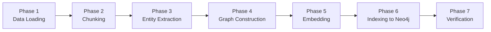

# Graph RAG Pipeline — Hệ Sinh Thái Pháp Điển & Án Lệ

> Pipeline xử lý dữ liệu cho hệ thống Graph RAG pháp lý Việt Nam.
> Từ dữ liệu thô trên HuggingFace (Pháp Điển, Án Lệ) → Knowledge Graph + Vector Index trên Neo4j.

---

## Tổng quan Pipeline

```text
Phase 1          Phase 2          Phase 3              Phase 4
Data Loading  →  Chunking      →  Entity Extraction →  Graph Construction
                                                              │
Phase 7          Phase 6          Phase 5              ◄──────┘
Query Ready   ←  Indexing       ←  Embedding Generation
```



| Phase | Input | Output | Module | Status |
|-------|-------|--------|--------|--------|
| 1. Data Loading | HF Datasets (Pháp Điển, Án Lệ) | Unified Parquet | `phapdien_load_dataset.py`, `anle_load_dataset.py` | ✅ |
| 2. Chunking | Unified articles & Anle | Chunks + `embed_text` | `phapdien_chunker.py`, `anle_chunker.py` | ✅ |
| 3. Entity Extraction | Chunks | `nodes.parquet` + `edges.parquet` | `entity_extractor.py`, `llm_extractor.py` | ✅ |
| 4. Graph Construction | nodes/edges.parquet | Knowledge Graph trong Neo4j | `graph_builder.py` | ⬜ |
| 5. Embedding | Chunks (`embed_text`) | Vectors 1024-dim | `embedder.py` | ⬜ |
| 6. Indexing | Vectors + Graph | Vector + Full-text Index | `index_builder.py` | ⬜ |
| 7. Verification | Neo4j DB | Test queries | manual / test script | ⬜ |

---

## Tech Stack Lựa Chọn

Dựa trên cấu hình hệ thống, Tech Stack cốt lõi cho Graph RAG được chốt như sau:
- **Framework Điều Phối**: **LangChain** và **LangGraph** (xây dựng luồng Agentic/Routing logic).
- **Cơ Sở Dữ Liệu**: **Neo4j** (hiện đang chạy sẵn qua Docker container) đóng vai trò hợp nhất cả Graph Database và Vector Database (sử dụng Neo4j Native Vector Index).
- **Mô Hình Embedding**: Sử dụng **`darklethelong/vnlegal-lal`** — model **Qwen3-Embedding** fine-tune cho domain Luật VN. Thông số: **1024 chiều**, **last-token pooling**, **max 2048 token**. Lưu ý: QUERY bắt buộc thêm instruction prefix, PASSAGE để raw (chi tiết Phase 5).
- **Trích Xuất Quan Hệ (Phase 3)**: **Qwen3-14B self-host qua vLLM** (OpenAI-compatible API, Docker — xem `deploy/vllm/`) kết hợp **guided JSON decoding** để bóc tách entity + quan hệ phức tạp đúng schema. (Không dùng Gemini.)

---

## Phase 1: Data Loading ✅

> **Status**: Đã hoàn thành — `phapdien_load_dataset.py` và `anle_load_dataset.py`

### Mục tiêu
Tải các subsets từ HuggingFace (Pháp Điển và Án Lệ), chuẩn hoá và tạo bộ dữ liệu phẳng thống nhất.

### Nguồn dữ liệu

**1. Pháp Điển (`tmquan/phapdien-moj-gov-vn`)**
- 6 subsets: `articles` (65K Điều luật), `subjects`, `tree_nodes`, `ontology_topics`, `ontology_subjects`, `ontology_glossary`.
- Xử lý: JOIN ontology để lấy tên chuẩn hoá, đóng gói `source_links`, tạo `hierarchy_path`.

**2. Án Lệ (`tmquan/anle-toaan-gov-vn`)**
- 2 subsets chính: `documents` (1,963 bản án), `sentences` (273K câu).
- Xử lý: Ép kiểu, chuẩn hoá metadata, xử lý missing values.

### Output

```text
knowlegde_data/
├── phapdien/
│   ├── phapdien_unified.jsonl          ← 65,967 điều (bộ chính)
│   ├── phapdien_tree_nodes.jsonl       ← 245 nodes cây phân cấp
│   └── ... (glossary, topics, subjects)
└── anle/
    ├── anle_unified.jsonl              ← 1,963 án lệ (bộ chính)
    └── anle_sentences.jsonl            ← 273K câu án lệ
```

### Schema unified (23 trường)

| Trường | Kiểu | Mô tả |
|--------|------|-------|
| `doc_id` | string | ID duy nhất (= record_id) |
| `article_id` | string | Mã trích dẫn phân cấp |
| `article_title` | string | Tên điều luật |
| `chapter_title` | string | Chương sở thuộc |
| `topic_id` | string | ID chủ đề |
| `topic_number` | int | Số thứ tự chủ đề |
| `topic_title_vi` | string | Tên chủ đề VI |
| `topic_title_en` | string | Tên chủ đề EN |
| `topic_note` | string | Ghi chú chủ đề |
| `subject_id` | string | ID đề mục |
| `subject_number` | int | Số thứ tự đề mục |
| `subject_title_vi` | string | Tên đề mục VI |
| `subject_title_en` | string | Tên đề mục EN |
| `content_text` | string | Toàn văn Điều luật |
| `content_char_len` | int | Số ký tự |
| `content_word_count` | int | Số từ |
| `source_note_text` | string | Ghi chú nguồn |
| `related_note_text` | string | Ghi chú liên quan |
| `source_links_json` | string | JSON links → VBPL gốc |
| `source_url` | string | URL trên phapdien.moj.gov.vn |
| `hierarchy_path` | string | Đường dẫn phân cấp đầy đủ |
| `scraped_at` | string | Thời gian thu thập |
| `metadata_json` | string | Metadata bổ sung (JSON) |

### Cách chạy
```python
from knowledge_processing.phapdien_load_dataset import PhapdienDatasetLoader

loader = PhapdienDatasetLoader()
unified_df = loader.run()
```

---

## Phase 2: Chunking (Pháp Điển) ✅

> **Status**: Đã hoàn thành — `phapdien_chunker.py`

### Mục tiêu
Chia `content_text` của mỗi Điều luật thành các chunks nhỏ, bảo toàn ngữ nghĩa pháp lý, phù hợp cho Embedding & Vector Search.

### Input
- `phapdien_unified.parquet` (65,967 Điều luật)

### Chiến lược: Structural-Aware Hybrid Chunking (3 tầng)

Pháp luật VN tuân thủ cấu trúc nghiêm ngặt: **Điều → Khoản → Điểm**. Do đó không dùng fixed-size chunking (sẽ cắt ngang Khoản, làm mất ngữ nghĩa), mà dùng pipeline 3 tầng:

```text
            ┌─────────────────────────────────────────────┐
            │          Mỗi Điều luật (content_text)       │
            └─────────────────┬───────────────────────────┘
                              │
                  ┌───────────▼───────────┐
        Tầng 1:  │  Regex Split by Khoản │  Tách theo "1. ", "2. ", "3. "
                  │  (KHOAN_PATTERN)      │  Intro merge vào Khoản 1
                  └───────────┬───────────┘
                              │
                  ┌───────────▼───────────┐
        Tầng 2:  │  Merge Khoản ngắn     │  Khoản < 80 chars → gộp
                  │  (min_chunk_size=80)  │  vào chunk liền kề
                  └───────────┬───────────┘
                              │
                  ┌───────────▼───────────┐
        Tầng 3:  │  Split Khoản dài      │  Khoản > 1000 chars → cắt
                  │  (RecursiveCharText)  │  bằng LangChain splitter
                  │  overlap=150 chars    │  Giữ prefix [...Khoản X]
                  └───────────┬───────────┘
                              │
                  ┌───────────▼───────────┐
                  │  Context Enrichment   │  Mỗi chunk có embed_text
                  │  hierarchy prefix     │  = "Topic > Subject > Chương > Điều"
                  └───────────────────────┘
```

#### Tầng 1: Regex Split by Khoản

Regex tìm ranh giới Khoản ở đầu mỗi dòng:

```python
KHOAN_PATTERN = re.compile(r"^([1-9]\d?)\.\s+(?=.{15,})", re.MULTILINE)
```

- `^` + `re.MULTILINE` → match đầu mỗi dòng
- `[1-9]\d?` → số 1-99 (không match "0.")
- `(?=.{15,})` → lookahead đảm bảo nội dung đủ dài (tránh match số thứ tự trong bảng)

Ví dụ:
```text
Điều 173. Tội trộm cắp tài sản             ← Intro → merge vào Khoản 1
├── Chunk 1: [intro + "1. Người nào..."]    ← type: "khoan"
├── Chunk 2: "2. Phạm tội thuộc..."         ← type: "khoan"
├── Chunk 3: "3. Phạm tội thuộc..."         ← type: "khoan"
└── Chunk 4: "4. Phạm tội thuộc..."         ← type: "khoan"
```

Nếu Điều luật không có cấu trúc Khoản → giữ nguyên toàn bộ → `type: "full"`.

#### Tầng 2: Merge Khoản ngắn

Một số "Khoản" thực chất chỉ là dòng ngắn (VD: `"3. Bãi bỏ."`) → embedding kém hiệu quả.

- Khoản < `min_chunk_size` (80 chars) → gộp vào chunk tiếp theo
- Khoản cuối → gộp ngược vào chunk trước đó

#### Tầng 3: Split Khoản dài

Khoản > `max_chunk_size` (1000 chars) → dùng `RecursiveCharacterTextSplitter`:

```python
separators = ["\n\n", "\n", ". ", "; ", ", ", " ", ""]
chunk_size = 1000, overlap = 150
```

Mỗi sub-chunk từ thứ 2 trở đi được thêm prefix `[...Khoản X]` để giữ context:
```text
Sub-chunk 1: "2. Phạm tội thuộc một trong các trường hợp sau đây..."
Sub-chunk 2: "[...2.] thì bị phạt tù từ hai năm đến bảy năm..."
```

Sub-chunks < 10 chars (mảnh vụn từ LangChain) bị lọc bỏ tự động.

### Context Enrichment (embed_text)

Mỗi chunk có 2 trường text:
- `chunk_text`: Nội dung gốc (để hiển thị cho user)
- `embed_text`: Nội dung để embedding = **hierarchy prefix** + chunk_text

```text
embed_text = "Hình sự > Bộ luật Hình sự > Chương XVI > Điều 173"
             + "\n"
             + "1. Người nào trộm cắp tài sản của người khác..."
```

Thứ tự prefix: **Topic > Subject > Chương > Điều** (đúng phân cấp Pháp Điển).

### Schema Output (18 trường)

```python
{
    "chunk_id": "doc_001::Điều 1.1.LQ.1::chunk::0",
    "chunk_index": 0,
    "chunk_total": 4,
    "chunk_type": "khoan",       # khoan | split | full
    "chunk_text": "1. Người nào trộm cắp...",
    "embed_text": "Hình sự > BLHS > Chương XVI > Điều 173\n1. Người nào...",
    "chunk_char_len": 350,
    "chunk_word_count": 78,
    "doc_id": "rec_abc123",
    "article_id": "Điều 1.1.LQ.1",
    "article_title": "Điều 173. Tội trộm cắp tài sản",
    "chapter_title": "Chương XVI - CÁC TỘI XÂM PHẠM SỞ HỮU",
    "topic_id": "topic_05",
    "topic_title_vi": "Hình sự",
    "subject_id": "subj_012",
    "subject_title_vi": "Bộ luật Hình sự",
    "hierarchy_path": "Hình sự > Bộ luật Hình sự > Chương XVI > Điều 173",
    "source_url": "https://phapdien.moj.gov.vn/..."
}
```

### Kết quả thực tế

| Metric | Giá trị |
|--------|---------|
| **Input** | 65,967 Điều luật |
| **Output** | **~218,000 chunks** |
| Chunks/Điều (TB) | 3.3 |
| Kích thước (TB) | 375 chars / 83 từ |
| Kích thước (median) | 281 chars / 62 từ |

| Chunk Type | Số lượng | % | Ý nghĩa |
|------------|----------|---|---------|
| `khoan` | ~166K | 76% | Tách theo Khoản — chiến lược chính |
| `split` | ~37K | 17% | Khoản dài bị cắt nhỏ bằng LangChain |
| `full` | ~15K | 7% | Điều ngắn, giữ nguyên toàn bộ |

### Cách chạy
```python
from knowledge_processing.phapdien_chunker import PhapdienChunker

chunker = PhapdienChunker()
chunks_df = chunker.run()
```

### Output files
```text
knowlegde_data/phapdien/
├── phapdien_chunks.jsonl       ← ~218K chunks
└── phapdien_chunks.parquet     ← ~97 MB (compressed)
```

---

## Phase 2.5: Chunking (Án Lệ) ✅

> **Status**: Đã hoàn thành — `anle_chunker.py`

### Mục tiêu
Chia nhỏ các văn bản Án Lệ (từ `anle_unified` + `anle_sentences`) thành chunks phù hợp cho Embedding & Vector Search, bảo toàn ngữ nghĩa của từng phần trọng tâm trong bản án.

### Input
- `anle_unified.parquet` (1,963 án lệ)
- `anle_sentences.parquet` (273,379 câu đã tách sẵn)

### Chiến lược: Section-Aware Chunking

Án lệ là văn bản tự do, không có cấu trúc Điều/Khoản/Điểm như Pháp Điển, nhưng được chia thành các phần (Sections): Tóm tắt vụ án, Nhận định của toà án, Quyết định. 
Chiến lược phân nhỏ tận dụng bảng `sentences` đã được xử lý sẵn:

1. **Gộp câu thành đoạn (Paragraph Assembly):**
   - Các câu (sentences) có cùng `paragraph_id` được gộp lại thành một đoạn văn hoàn chỉnh.
2. **Gộp đoạn thành Chunk (Chunk Assembly):**
   - Các đoạn văn liên tiếp có cùng `section_kind` (vd: `findings`, `case_summary`, `decision`) được gộp lại.
   - Quá trình gộp dừng lại khi tổng số ký tự chạm ngưỡng `max_chunk_size` (1000 chars).
   - Nếu một đoạn văn quá dài (vượt quá 1000 ký tự), `RecursiveCharacterTextSplitter` (LangChain) sẽ được kích hoạt để cắt đoạn đó ra cho đúng chuẩn.
3. **Merge Short Chunks:**
   - Các chunk quá ngắn (< 80 chars) sẽ tự động được gộp vào chunk liền kề để tránh làm loãng ngữ nghĩa.
   - Lọc bỏ triệt để các mảnh vụn rác (< 10 chars).
4. **Context Enrichment (embed_text):**
   - Mỗi chunk được gắn tự động một prefix ngữ cảnh để Embedding Model hiểu rõ nguồn gốc:
   - Cấu trúc: `[Loại vụ án] Tên bản án (Vấn đề pháp lý) | Phần: <Tên phần>`
   - Ví dụ: `[dan_su] Bản án số: 38/2021/DS-PT (Tranh chấp hợp đồng đặt cọc) | Phần: Nhận định của Toà án`

### Kết quả thực tế

| Metric | Giá trị |
|--------|---------|
| **Input** | 1,963 Án lệ / 273,379 Câu |
| **Output** | **52,406 chunks** |
| Kích thước chunk (TB) | 702 chars |
| Kích thước chunk (median) | 779 chars |

| Chunk Type | Số lượng | Ý nghĩa |
|------------|----------|---------|
| `case_summary` | 31,814 | Tóm tắt vụ án |
| `findings` | 16,341 | Nhận định của Toà án (Phần lõi quan trọng nhất) |
| `decision` | 4,251 | Quyết định của Toà án |

*(Lưu ý: Header và Footer của bản án được lược bỏ do không mang nhiều giá trị tra cứu).*

### Output files
```text
knowlegde_data/anle/
├── anle_chunks.jsonl       ← 52K chunks
└── anle_chunks.parquet     ← Compressed, Typed Data
```

---

## Phase 3: Entity Extraction

> **Status**: ✅ Đã triển khai — `entity_extractor.py` (orchestrator 3 lớp) + `llm_extractor.py` (Lớp 2) + `schema/extraction_schema.py` (Pydantic schema)
> - **Lớp 1 (regex):** VBPL có số hiệu, Điều, Khung hình phạt.
> - **Lớp 2 (LLM — Qwen3-14B self-host qua vLLM):** entity + quan hệ phức tạp bằng **guided JSON decoding** (async, pre-filter dấu hiệu quan hệ, checkpoint/resume). LLM đọc `embed_text` **tách 2 mục NGỮ CẢNH/NỘI DUNG** + **retry chống cắt cụt JSON**. Bật bằng `use_llm=True`, **cần vLLM đang chạy** (`make vllm-up`).
> - **Lớp 3 (source_links):** `Article -THUOC-> VBPL` từ `source_links_json` (phủ ~100%, chính xác cao, miễn phí).
> - Output: `knowlegde_data/graph/nodes.parquet` & `edges.parquet`.

### Mục tiêu
Trích xuất thực thể pháp lý và quan hệ giữa chúng từ nội dung chunks.

### Các loại Entity cho domain pháp luật VN

Schema 7 loại entity (định nghĩa ở `schema/extraction_schema.py`). Cột "Nguồn" cho biết lớp nào sinh ra:

| Entity Type | Ví dụ | Nguồn |
|-------------|-------|-------|
| `VBPL` (Văn bản pháp luật) | "Luật số 32/2004/QH11", "Nghị định 43/2014/NĐ-CP" | Lớp 1 (regex số hiệu) + Lớp 3 (source_links) + Lớp 2 (LLM) |
| `DIEU` (Điều luật) | "Điều 173", "khoản 2 Điều 8" | Lớp 1 (regex) + Lớp 2 (LLM) |
| `KHUNG_HINH_PHAT` (Khung hình phạt) | "phạt tù từ 3-7 năm", "phạt tiền 50 triệu" | Lớp 1 (regex) + Lớp 2 (LLM) |
| `CO_QUAN` (Cơ quan) | "Bộ Tư pháp", "UBND tỉnh", "Chính phủ" | Lớp 2 (LLM) |
| `LINH_VUC` (Lĩnh vực) | "đất đai", "hình sự", "dân sự" | Lớp 2 (LLM) |
| `THOI_GIAN` (Thời gian) | "2015", "ngày 01/01/2020" | Lớp 2 (LLM) |
| `CHU_THE` (Chủ thể) | "người lao động", "người sử dụng đất" | Lớp 2 (LLM) |

### Các loại Relation

6 loại relation (schema `extraction_schema.py`). 5 loại đầu do **Lớp 2 (LLM)** trích từ văn bản; `THUOC` chủ yếu do **Lớp 3 (source_links)** sinh ra (Article→VBPL).

| Relation | Ý nghĩa | Ví dụ / Nguồn |
|----------|---------|-------|
| `TRICH_DAN` (Trích dẫn) | A dẫn chiếu B | "theo quy định tại Điều 173" — Lớp 2 |
| `SUA_DOI` (Sửa đổi) | VB mới sửa đổi VB cũ | "sửa đổi bởi Luật số 12/2017" — Lớp 2 |
| `HUONG_DAN` (Hướng dẫn) | VB hướng dẫn thi hành VB khác | "hướng dẫn thi hành Luật Đất đai" — Lớp 2 |
| `THAY_THE` (Thay thế) | VB mới thay thế VB cũ | "thay thế Nghị định 181/2004" — Lớp 2 |
| `LIEN_QUAN` (Liên quan) | Liên kết chung | Lớp 2 |
| `THUOC` (Thuộc) | Điều/Article thuộc VBPL gốc | `Article→THUOC→VBPL` — Lớp 3 (source_links) |

> Ngoài ra graph còn có các edge cấu trúc (không phải từ schema LLM): `BELONGS_TO`
> (Chunk→Article/AnLe), `MENTIONS` (Chunk→Entity), `APPLIES_ARTICLE` (AnLe→Entity:DIEU).

### Phương pháp trích xuất

#### Lớp 1: Rule-based (nhanh, chính xác cao)
Chỉ bắt **VBPL có số hiệu rõ ràng** (tránh nhiễu "Luật này", "luật của"), Điều, Khung hình phạt:
```python
# VBPL có số hiệu (VD: "Luật số 32/2004/QH11", "Nghị định 43/2014/NĐ-CP")
VBPL_PATTERN = re.compile(
    r'(?:Bộ luật|Luật|Nghị định|Nghị quyết|Pháp lệnh|Thông tư liên tịch|Thông tư|Quyết định)'
    r'\s+(?:số\s+)?\d+[\w.\-]*/[\w.\-/]+', re.IGNORECASE)

DIEU_PATTERN = re.compile(r'(?:khoản\s+\d+[a-z]?\s+)?Điều\s+\d+[a-z]?', re.IGNORECASE)
```

#### Lớp 2: LLM-based — Qwen3-14B self-host qua vLLM
Self-host **Qwen3-14B** bằng vLLM (OpenAI-compatible), gọi qua `openai` SDK async với
**guided JSON decoding** (`response_format=json_schema` từ Pydantic `ExtractionResult`)
→ output luôn đúng schema, gần như 0% lỗi parse. Qwen3 chạy non-thinking
(`enable_thinking=false`).

Tối ưu cho ~270k chunk:
- **Pre-filter**: chỉ gọi LLM cho chunk có "dấu hiệu quan hệ" (sửa đổi / thay thế /
  hướng dẫn / dẫn chiếu...) → ~22% (≈ **60.249 lần gọi**). Chunk còn lại đã được Lớp 1
  phủ entity. Lọc tín hiệu dựa trên `chunk_text` (nội dung thật).
- **Ngữ cảnh tách biệt**: LLM nhận `embed_text` (qua `embed_col="embed_text"`) nhưng prompt
  CHIA 2 mục — `## NGỮ CẢNH` (tiền tố phân cấp/bản án: chỉ để HIỂU, KHÔNG trích) và
  `## NỘI DUNG` (CHỈ trích entity/quan hệ từ đây). Nhờ vậy LLM biết chunk thuộc luật/điều/vụ
  án nào để qualify đúng tham chiếu (vd "khoản 2" thuộc Điều nào) mà **không trích tiêu đề
  chủ đề/chương/mục thành entity rác**.
- **Độ bền (chống cắt cụt JSON)**: `max_tokens=3072`; nếu output bị cắt cụt
  (`finish_reason == "length"`) hoặc parse JSON fail → **retry 1 lần với budget gấp đôi
  (~6144)**. Tránh mất các chunk dày đặc entity (vốn là điều luật quan trọng).
- **Async + concurrency** (vLLM continuous batching) + **checkpoint/resume**
  (`llm_extract_checkpoint.jsonl`): dừng/chạy lại an toàn, không gọi lại chunk đã xong.

```python
# llm_extractor.py — guided JSON
response_format = {"type": "json_schema",
                   "json_schema": {"name": "ExtractionResult",
                                   "schema": ExtractionResult.model_json_schema()}}
```

#### Lớp 3: Từ source_links (metadata, phủ ~100%)
Mỗi Điều có `source_links_json` → tên + ItemID của VBPL gốc trên vbpl.vn.
→ Tự động tạo node `VBPL` (dedup theo ItemID) và relation `Article --THUOC--> VBPL`.

### Output — `knowlegde_data/graph/nodes.parquet` & `edges.parquet`
```text
nodes: {id, label, properties(JSON str)}   label ∈ {CHUNK, ARTICLE, AN_LE, ENTITY}
edges: {source_id, target_id, type, properties(JSON str)}
       type ∈ {BELONGS_TO, THUOC, APPLIES_ARTICLE, MENTIONS,   # Lớp 1+3
               TRICH_DAN, SUA_DOI, HUONG_DAN, THAY_THE, LIEN_QUAN}  # Lớp 2 (LLM)
```

### Cách chạy (chiến lược staged)
vLLM phải đang chạy (`make vllm-up` / `make vllm-health`). Chạy full 3 lớp:
```bash
cd backend
PYTHONPATH=src nohup venv/bin/python -m knowledge_processing.entity_extractor \
  > phase3_full.log 2>&1 &
```
- Lớp 1 + Lớp 3: vài phút. Lớp 2 (LLM): job dài (~16–63h tùy concurrency / quantization).
- **Staged**: graph từ Lớp 1+3 đã đủ để dựng Phase 4 ngay; Lớp 2 chạy nền, gộp quan hệ
  vào graph sau (nạp Neo4j bằng MERGE nên idempotent).
- Dừng giữa chừng → chạy lại đúng lệnh trên là làm tiếp từ checkpoint.
- ⚠️ Khi **đổi prompt/logic Lớp 2** (vd tách NGỮ CẢNH/NỘI DUNG), nên
  `rm knowlegde_data/graph/llm_extract_checkpoint.jsonl` rồi chạy lại để toàn bộ chunk được
  trích đồng nhất theo phiên bản mới (checkpoint cũ vẫn được giữ nguyên nếu không xoá).

---

## Phase 4: Graph Construction

> **Status**: ⬜ Chưa triển khai — `graph_builder.py`

### Mục tiêu
Nạp `nodes.parquet` + `edges.parquet` (Phase 3) vào **Neo4j** để dựng Knowledge Graph.
Dùng **MERGE** (idempotent) → chạy lại nhiều lần (vd sau khi Lớp 2 LLM bổ sung quan hệ)
đều an toàn, không nhân đôi.

### Đầu vào (định dạng generic từ Phase 3)
```text
nodes.parquet : {id, label, properties(JSON str)}   label ∈ {CHUNK, ARTICLE, AN_LE, ENTITY}
edges.parquet : {source_id, target_id, type, properties(JSON str)}
```

### Graph schema THỰC TẾ (đúng những gì Phase 3 sinh ra)

```text
   ┌──────────┐   BELONGS_TO   ┌──────────┐   THUOC    ┌──────────────┐
   │  CHUNK   │───────────────►│ ARTICLE  │───────────►│ ENTITY:VBPL  │
   │ (~270K)  │                │ (~66K)   │            └──────────────┘
   └────┬─────┘                └──────────┘
        │ MENTIONS
        ▼                       ┌──────────┐  APPLIES_ARTICLE  ┌──────────────┐
   ┌──────────┐   BELONGS_TO    │  AN_LE   │──────────────────►│ ENTITY:DIEU  │
   │  ENTITY  │◄────────────────│ (~1.96K) │                   └──────────────┘
   └──────────┘                 └──────────┘
   ENTITY type ∈ {VBPL, DIEU, CO_QUAN, KHUNG_HINH_PHAT, LINH_VUC, THOI_GIAN, CHU_THE}

   Quan hệ Lớp 2 (LLM) giữa ENTITY ↔ ENTITY:
   TRICH_DAN / SUA_DOI / HUONG_DAN / THAY_THE / LIEN_QUAN
```

**Node keys:** `CHUNK.id = chunk_id` · `ARTICLE.id = doc_id` (1:1 với Điều, **unique**) ·
`AN_LE.id = doc_id` · `ENTITY.id = "ENT::<TYPE>::<tên lowercase>"` (riêng VBPL từ
source_links dùng `VBPL::<ItemID>`).

### Constraints (theo `id` của từng label)
```cypher
CREATE CONSTRAINT chunk_id   IF NOT EXISTS FOR (c:Chunk)   REQUIRE c.id IS UNIQUE;
CREATE CONSTRAINT article_id IF NOT EXISTS FOR (a:Article) REQUIRE a.id IS UNIQUE;
CREATE CONSTRAINT anle_id    IF NOT EXISTS FOR (n:AnLe)    REQUIRE n.id IS UNIQUE;
CREATE CONSTRAINT entity_id  IF NOT EXISTS FOR (e:Entity)  REQUIRE e.id IS UNIQUE;
```

### Nạp nodes (UNWIND + MERGE theo từng label)
```python
# row = {"id": n.id, "props": json.loads(n.properties)}
query = """
UNWIND $rows AS row
MERGE (n:%s {id: row.id})
SET n += row.props
""" % label          # label: Chunk | Article | AnLe | Entity
```

### Nạp edges (UNWIND + MERGE theo cặp id + type)
```python
# row = {"source_id", "target_id", "props"}
query = """
UNWIND $rows AS row
MATCH (a {id: row.source_id})
MATCH (b {id: row.target_id})
MERGE (a)-[r:`%s`]->(b)
SET r += row.props
""" % rel_type
```

### Edge types trong graph
| Edge | From → To | Nguồn |
|------|-----------|-------|
| `BELONGS_TO` | Chunk → Article / AnLe | Phase 3 (cấu trúc) |
| `MENTIONS` | Chunk → Entity | Lớp 1 (regex) + Lớp 2 (LLM) |
| `THUOC` | Article → Entity:VBPL | Lớp 3 (source_links) |
| `APPLIES_ARTICLE` | AnLe → Entity:DIEU | metadata (⚠️ xem cảnh báo) |
| `TRICH_DAN` / `SUA_DOI` / `HUONG_DAN` / `THAY_THE` / `LIEN_QUAN` | Entity → Entity | Lớp 2 (LLM) |

> ⚠️ **Cảnh báo khóa nối AnLe → Article (đã kiểm bằng dữ liệu):**
> - `applied_article_code` (BLDS, BLHS…): **chỉ 2/1963 dòng có giá trị** (~99,9% rỗng).
> - `applied_article_number`: 1946/1963 có, nhưng chỉ là **số Điều trần** (468, 147…).
> - `applied_article_clause`: **0/1963** (toàn 0).
> - Phía Pháp điển KHÔNG có cột mã luật; `article_id` dạng `"Điều 1.1.LQ.1"` ≠ `"Điều 468"`.
>
> ⇒ **Không thể nối AnLe → Article chỉ bằng metadata này.** Vì vậy graph hiện nối
> `AnLe → APPLIES_ARTICLE → Entity:DIEU` (node "Điều N" trần), KHÔNG trỏ trực tiếp Article.
> Muốn nối chính xác: parse mã luật + số điều từ `principle_text`/`content_markdown` của án
> lệ (Lớp 2 LLM), rồi resolve về đúng `article_id`.

### (Tuỳ chọn / tương lai) Làm giàu hierarchy
Phase 3 hiện **CHƯA** sinh node Topic/Subject/Chapter/Glossary — thông tin topic/subject/
chapter đang nằm trong **properties của ARTICLE**. Khi cần điều hướng phân cấp tốt hơn,
dựng thêm từ dữ liệu Phase 1 (đây là việc của `graph_builder.py`, không bắt buộc cho RAG cơ bản):
- `ontology_topics` (42) → `Topic`; `ontology_subjects` (202) → `Subject`;
  `tree_nodes` (245) → cây `HAS_CHILD`; nối `Topic→HAS_SUBJECT→Subject→HAS_ARTICLE→Article`.
- `ontology_glossary` (116) → `Glossary` + edge `USES` (chunk chứa thuật ngữ).

---

## Phase 5: Embedding Generation

> **Status**: ⬜ Chưa triển khai — `embedder.py` (model wrapper `embedding_models.py` đã ✅)

### Mục tiêu
Sinh vector embeddings cho chunks và entities.

### Đối tượng cần embedding

| Đối tượng | Text đầu vào | Mục đích | Ưu tiên |
|-----------|--------------|----------|---------|
| Chunk | **`embed_text`** (đã có sẵn context prefix phân cấp từ Phase 2) | Vector search chính | **Bắt buộc** |
| Article | `article_title + hierarchy_path` | Metadata search | Tuỳ chọn |
| Entity | `entity.name + entity.type` | Entity linking | Tuỳ chọn |
| Glossary | `vi + en + note` | Query expansion | Tuỳ chọn |

> ⚠️ Embed thẳng trường **`embed_text`** — KHÔNG nối lại `hierarchy_path` lần nữa (chunker đã chèn rồi, nối lại sẽ double prefix).

### Embedding Model — `darklethelong/vnlegal-lal`

Model **Qwen3-Embedding** fine-tune cho pháp luật VN. Thông số xác nhận từ model card:

| Thuộc tính | Giá trị |
|------------|---------|
| Embedding dimension | **1024** |
| Pooling | **Last-token** (không phải mean) |
| Max sequence length | **2048 token** |
| Similarity | cosine (vector đã normalize) |

> ⚠️ **Giới hạn token:** ~**4,05% chunk Pháp điển vượt 2048 token** (chunk bảng biểu/số dày đặc) sẽ bị truncate. Án lệ: 0%. Đã chấp nhận như giới hạn đã biết.
>
> ⚠️ Tokenizer config báo `model_max_length=512` là **nhầm** — dùng 2048.

### Prefix cho embedding (QUAN TRỌNG — chuẩn Qwen3)

Khác với E5 (`passage:`/`query:`), Qwen3-Embedding dùng **instruction prefix chỉ cho QUERY**, còn PASSAGE để raw:

```python
# PASSAGE / document (lúc index): KHÔNG thêm prefix, dùng thẳng embed_text
passage_text = chunk["embed_text"]

# QUERY (lúc retrieval): BẮT BUỘC thêm instruction prefix
QUERY_INSTRUCTION = (
    "Instruct: Given a Vietnamese legal question, retrieve relevant legal "
    "passages that answer the question\nQuery: "
)
query_text = f"{QUERY_INSTRUCTION}{user_question}"
```

`LegalEmbeddingModel.embed_query()` đã tự động thêm prefix này; `embed_documents()` giữ raw. Chỉ cần truyền đúng `embed_text` cho document.

### Batch processing

```python
from infrastructures.embedding_models.embedding_models import LegalEmbeddingModel

model = LegalEmbeddingModel(batch_size=64)   # max_seq_length=2048 mặc định

BATCH_SIZE = 256
for i in range(0, len(chunks), BATCH_SIZE):
    batch = chunks[i : i + BATCH_SIZE]
    texts = [c["embed_text"] for c in batch]      # ← embed_text, KHÔNG phải chunk_text
    embeddings = model.embed_documents(texts)
    # Lưu embeddings vào chunks
```

### Output
- Mỗi chunk có thêm trường `embedding: list[float]` — **1024 dim**
- `phapdien_chunks_with_embeddings.parquet`

---

## Phase 6: Indexing to Neo4j

> **Status**: ⬜ Chưa triển khai — `index_builder.py`

### Mục tiêu
Sau khi graph đã có trong Neo4j (Phase 4) và đã sinh embedding (Phase 5): **ghi vector vào
node Chunk** + tạo **Vector Index** & **Full-text Index** phục vụ hybrid retrieval.
(Việc nạp node/edge đã làm ở Phase 4 — Phase 6 chỉ lo embedding + index.)

### Bước 1: Ghi embedding vào node Chunk
```python
# rows = [{"chunk_id": ..., "vector": [...1024...]}] từ Phase 5
query = """
UNWIND $rows AS row
MATCH (c:Chunk {id: row.chunk_id})
CALL db.create.setNodeVectorProperty(c, 'embedding', row.vector)
"""
```

### Bước 2: Vector Index (1024, cosine)
```cypher
-- dimensions = 1024 (model vnlegal-lal: hidden_size=1024); cosine vì vector đã normalize
CREATE VECTOR INDEX chunk_embedding_index IF NOT EXISTS
FOR (c:Chunk) ON (c.embedding)
OPTIONS { indexConfig: {
    `vector.dimensions`: 1024,
    `vector.similarity_function`: 'cosine'
}};
```

### Bước 3: Full-text Index (keyword cho hybrid)
```cypher
-- Lưu ý property thật: Chunk.text, Entity.name (xem nodes.parquet)
CREATE FULLTEXT INDEX chunk_fulltext IF NOT EXISTS
FOR (c:Chunk) ON EACH [c.text];

CREATE FULLTEXT INDEX entity_fulltext IF NOT EXISTS
FOR (e:Entity) ON EACH [e.name];
```

---

## Phase 7: Verification

> **Status**: ⬜ Chưa triển khai

### Kiểm tra sau khi indexing

```cypher
-- Đếm nodes theo label
MATCH (n) RETURN labels(n)[0] AS label, count(*) AS count ORDER BY count DESC;

-- Đếm edges theo loại
MATCH ()-[r]->() RETURN type(r) AS rel_type, count(r) AS count ORDER BY count DESC;

-- Test vector search (property thật: c.text)
CALL db.index.vector.queryNodes('chunk_embedding_index', 5, $test_embedding)
YIELD node, score
RETURN node.text, score;

-- Test graph traversal: từ 1 Án lệ → Điều áp dụng; từ Chunk → Article → VBPL gốc
MATCH (al:AnLe)-[:APPLIES_ARTICLE]->(d:Entity)
RETURN al.title, d.name LIMIT 5;

MATCH (c:Chunk)-[:BELONGS_TO]->(a:Article)-[:THUOC]->(v:Entity)
RETURN a.id, v.name LIMIT 5;
```

### Kết quả mong đợi (theo graph thực tế Phase 3)

| Node label | Giá trị ước tính | Ghi chú |
|------------|------------------|---------|
| `Chunk` | ~270,000 | 217,9K Pháp điển + 52,4K Án lệ |
| `Article` | ~65,967 | 1:1 với Điều (keyed `doc_id`) |
| `AnLe` | ~1,817 | án lệ có chunk |
| `Entity` | vài chục nghìn | VBPL/DIEU/KHUNG_HINH_PHAT (regex) + VBPL (source_links) + entity LLM |

| Edge type | Ghi chú |
|-----------|---------|
| `BELONGS_TO` | ~270K (1/chunk) |
| `MENTIONS` | nhiều (regex + LLM) |
| `THUOC` | ~60–70K (Article→VBPL, ~1.1/Điều) |
| `APPLIES_ARTICLE` | ~1,946 (AnLe→Entity:DIEU) |
| `TRICH_DAN`/`SUA_DOI`/`HUONG_DAN`/`THAY_THE`/`LIEN_QUAN` | từ Lớp 2 (LLM), tăng dần khi job LLM chạy |

> Topic/Subject/Glossary chỉ xuất hiện nếu đã chạy phần làm giàu hierarchy tuỳ chọn (Phase 4).

---

## Tổng kết: Dữ liệu nào dùng ở Phase nào

| File (Phase 1) | Phase 2 | Phase 3 | Phase 4 | Phase 5 | Phase 6 |
|----------------|---------|---------|---------|---------|---------|
| `phapdien_unified` | ✅ Input chunk | ✅ Lớp 3 source_links → VBPL/THUOC | ✅ qua nodes/edges | — | — |
| `phapdien_chunks` | (output P2) | ✅ Input Lớp 1+2 | ✅ CHUNK/ARTICLE nodes | ✅ Embed `embed_text` | ✅ Ghi vector vào Chunk |
| `anle_unified` | ✅ Input chunk | ✅ AnLe + APPLIES_ARTICLE | ✅ qua nodes/edges | — | — |
| `anle_chunks` | (output P2) | ✅ Input Lớp 1+2 | ✅ CHUNK/AN_LE nodes | ✅ Embed `embed_text` | ✅ Ghi vector vào Chunk |
| `nodes/edges.parquet` | — | (output P3) | ✅ Nạp vào Neo4j | — | — |
| `tree_nodes` / `ontology_*` / `glossary` | — | — | ⬜ Hierarchy (tuỳ chọn) | — | — |

---

## Cấu trúc thư mục dự kiến

```text
backend/src/
├── knowledge_processing/
│   ├── phapdien_load_dataset.py   ← Phase 1 ✅
│   ├── anle_load_dataset.py       ← Phase 1 ✅
│   ├── phapdien_chunker.py        ← Phase 2 ✅
│   ├── anle_chunker.py            ← Phase 2 ✅
│   ├── entity_extractor.py        ← Phase 3 ✅ (orchestrator 3 lớp)
│   ├── llm_extractor.py           ← Phase 3 ✅ (Lớp 2 — vLLM/Qwen3-14B)
│   ├── graph_builder.py           ← Phase 4 ⬜
│   ├── embedder.py                ← Phase 5 ⬜
│   └── index_builder.py           ← Phase 6 ⬜
├── schema/extraction_schema.py    ← Phase 3 ✅ (Pydantic Entity/Relation)
└── infrastructures/
    ├── embedding_models/embedding_models.py  ← Phase 5 ✅ (vnlegal-lal wrapper)
    └── llm/gemini.py               ← (tuỳ chọn, không dùng cho Phase 3)

deploy/vllm/                        ← Docker đóng gói vLLM Qwen3-14B (Lớp 2)
docker-compose.yml                  ← service "neo4j" + "vllm" (profile llm)
```
