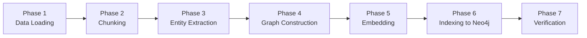

# Graph RAG Pipeline — Hệ Sinh Thái Pháp Điển & Án Lệ

> Pipeline xử lý dữ liệu cho hệ thống Graph RAG pháp lý Việt Nam.
> Từ dữ liệu thô trên HuggingFace (Pháp Điển, Án Lệ) → Knowledge Graph + Vector Index trên Neo4j.

---

## Tổng quan Pipeline

```text
Phase 1          Phase 2          Phase 3              Phase 4
Data Loading  →  Chunking      →  Entity Extraction →  Graph Construction
                                                              │
Phase 7          Phase 6          Phase 5              ◄──────┘
Query Ready   ←  Indexing       ←  Embedding Generation
```



| Phase | Input | Output | Module |
|-------|-------|--------|--------|
| 1. Data Loading | HF Datasets (Pháp Điển, Án Lệ) | Unified JSONL/Parquet | `*_load_dataset.py` |
| 2. Chunking | Unified articles & Anle | Chunks với metadata | `chunker.py` |
| 3. Entity Extraction | Chunks | Entities + Relations | `entity_extractor.py` |
| 4. Graph Construction | Entities + Relations | Graph schema | `graph_builder.py` |
| 5. Embedding | Chunks + Entities | Vectors | `embedder.py` |
| 6. Indexing | Graph + Vectors | Neo4j DB | `index_builder.py` |
| 7. Verification | Neo4j DB | Test queries | manual / test script |

---

## Tech Stack Lựa Chọn

Dựa trên cấu hình hệ thống, Tech Stack cốt lõi cho Graph RAG được chốt như sau:
- **Framework Điều Phối**: **LangChain** và **LangGraph** (xây dựng luồng Agentic/Routing logic).
- **Cơ Sở Dữ Liệu**: **Neo4j** (hiện đang chạy sẵn qua Docker container) đóng vai trò hợp nhất cả Graph Database và Vector Database (sử dụng Neo4j Native Vector Index).
- **Mô Hình Embedding**: Sử dụng **`darklethelong/vnlegal-lal`** (Model Embedding Pháp Lý tuỳ chỉnh) để sinh vector chuyên biệt cho domain Luật.
- **Trích Xuất Quan Hệ (Phase 3)**: Sử dụng **Gemini API** kết hợp Structured Output (qua LangChain) để bóc tách các entity và quan hệ phức tạp.

---

## Phase 1: Data Loading ✅

> **Status**: Đã hoàn thành — `phapdien_load_dataset.py` và `anle_load_dataset.py`

### Mục tiêu
Tải các subsets từ HuggingFace (Pháp Điển và Án Lệ), chuẩn hoá và tạo bộ dữ liệu phẳng thống nhất.

### Nguồn dữ liệu

**1. Pháp Điển (`tmquan/phapdien-moj-gov-vn`)**
- 6 subsets: `articles` (65K Điều luật), `subjects`, `tree_nodes`, `ontology_topics`, `ontology_subjects`, `ontology_glossary`.
- Xử lý: JOIN ontology để lấy tên chuẩn hoá, đóng gói `source_links`, tạo `hierarchy_path`.

**2. Án Lệ (`tmquan/anle-toaan-gov-vn`)**
- 2 subsets chính: `documents` (1,963 bản án), `sentences` (273K câu).
- Xử lý: Ép kiểu, chuẩn hoá metadata, xử lý missing values.

### Output

```text
knowlegde_data/
├── phapdien/
│   ├── phapdien_unified.jsonl          ← 65,967 điều (bộ chính)
│   ├── phapdien_tree_nodes.jsonl       ← 245 nodes cây phân cấp
│   └── ... (glossary, topics, subjects)
└── anle/
    ├── anle_unified.jsonl              ← 1,963 án lệ (bộ chính)
    └── anle_sentences.jsonl            ← 273K câu án lệ
```

### Schema unified (23 trường)

| Trường | Kiểu | Mô tả |
|--------|------|-------|
| `doc_id` | string | ID duy nhất (= record_id) |
| `article_id` | string | Mã trích dẫn phân cấp |
| `article_title` | string | Tên điều luật |
| `chapter_title` | string | Chương sở thuộc |
| `topic_id` | string | ID chủ đề |
| `topic_number` | int | Số thứ tự chủ đề |
| `topic_title_vi` | string | Tên chủ đề VI |
| `topic_title_en` | string | Tên chủ đề EN |
| `topic_note` | string | Ghi chú chủ đề |
| `subject_id` | string | ID đề mục |
| `subject_number` | int | Số thứ tự đề mục |
| `subject_title_vi` | string | Tên đề mục VI |
| `subject_title_en` | string | Tên đề mục EN |
| `content_text` | string | Toàn văn Điều luật |
| `content_char_len` | int | Số ký tự |
| `content_word_count` | int | Số từ |
| `source_note_text` | string | Ghi chú nguồn |
| `related_note_text` | string | Ghi chú liên quan |
| `source_links_json` | string | JSON links → VBPL gốc |
| `source_url` | string | URL trên phapdien.moj.gov.vn |
| `hierarchy_path` | string | Đường dẫn phân cấp đầy đủ |
| `scraped_at` | string | Thời gian thu thập |
| `metadata_json` | string | Metadata bổ sung (JSON) |

### Cách chạy
```python
from knowledge_processing.phapdien_load_dataset import PhapdienDatasetLoader

loader = PhapdienDatasetLoader()
unified_df = loader.run()
```

---

## Phase 2: Chunking

> **Status**: Chưa triển khai — `chunker.py`

### Mục tiêu
Chia `content_text` của mỗi Điều luật thành các chunks nhỏ phù hợp cho embedding.

### Input
- `phapdien_unified.jsonl` (65,967 Điều)

### Chiến lược chunking cho pháp luật

#### Option A: Khoản-level chunking (Recommended)
Pháp luật VN có cấu trúc rõ ràng: Điều → Khoản → Điểm.
Tách theo ranh giới Khoản tự nhiên.

```text
Điều 173. Tội trộm cắp tài sản
├── Chunk 1: "1. Người nào trộm cắp tài sản của người khác..."
├── Chunk 2: "2. Phạm tội thuộc một trong các trường hợp..."
├── Chunk 3: "3. Phạm tội thuộc một trong các trường hợp..."
└── Chunk 4: "4. Phạm tội thuộc một trong các trường hợp..."
```

Regex pattern nhận biết Khoản:
```python
KHOAN_PATTERN = r'(?:^|\n)(\d+)\.\s'
```

#### Option B: Sliding window (Fallback)
Cho các Điều không có cấu trúc Khoản rõ ràng.
- chunk_size: 500-800 tokens
- overlap: 100-150 tokens

#### Option C: Hybrid
- Thử tách theo Khoản trước
- Nếu Khoản quá dài → sliding window trên Khoản đó
- Nếu Điều không có Khoản → sliding window trên toàn Điều

### Metadata kế thừa cho mỗi Chunk

Mỗi chunk phải mang theo metadata của Điều cha:

```python
{
    "chunk_id": "doc_001_chunk_003",
    "doc_id": "doc_001",                    # từ unified
    "article_id": "Điều 1.1.LQ.1",         # từ unified
    "article_title": "Điều 1. ...",         # từ unified
    "chapter_title": "Chương I ...",        # từ unified
    "topic_id": "...",                      # từ unified
    "topic_title_vi": "Hiến pháp",          # từ unified
    "subject_id": "...",                    # từ unified
    "subject_title_vi": "Hiến pháp 2013",   # từ unified
    "hierarchy_path": "Hiến pháp > ...",    # từ unified
    "source_url": "https://...",            # từ unified

    "chunk_index": 3,                       # mới
    "chunk_total": 5,                       # mới
    "chunk_text": "3. Phạm tội thuộc...",   # mới — nội dung chunk
    "chunk_char_len": 450,                  # mới
    "chunk_type": "khoan",                  # mới — khoan | sliding | full
}
```

### Output
- `phapdien_chunks.jsonl` — mỗi dòng = 1 chunk
- Dự kiến: ~150,000–200,000 chunks (65K điều × trung bình 2-3 khoản)

---

## Phase 3: Entity Extraction

> **Status**: Chưa triển khai — `entity_extractor.py`

### Mục tiêu
Trích xuất thực thể pháp lý và quan hệ giữa chúng từ nội dung chunks.

### Các loại Entity cho domain pháp luật VN

| Entity Type | Ví dụ | Cách nhận biết |
|-------------|-------|----------------|
| `VBPL` (Văn bản pháp luật) | "Luật Hình sự 2015", "Nghị định 43/2014/NĐ-CP" | Regex pattern + NER |
| `DIEU` (Điều luật) | "Điều 173", "khoản 2 Điều 8" | Regex: `Điều \d+` |
| `CO_QUAN` (Cơ quan) | "Bộ Tư pháp", "UBND tỉnh", "Chính phủ" | NER + dictionary |
| `KHUNG_HINH_PHAT` (Khung hình phạt) | "phạt tù từ 3-7 năm", "phạt tiền 50 triệu" | Regex pattern |
| `LINH_VUC` (Lĩnh vực) | "đất đai", "hình sự", "dân sự" | Từ ontology_glossary |
| `THOI_GIAN` (Thời gian) | "2015", "ngày 01/01/2020" | Regex date pattern |
| `CHU_THE` (Chủ thể) | "người lao động", "người sử dụng đất" | NER |

### Các loại Relation

| Relation | Ý nghĩa | Ví dụ |
|----------|---------|-------|
| `TRICH_DAN` (Trích dẫn) | Điều A dẫn chiếu Điều B | "theo quy định tại Điều 173" |
| `SUA_DOI` (Sửa đổi) | VB mới sửa đổi VB cũ | "sửa đổi bởi Luật số 12/2017" |
| `HUONG_DAN` (Hướng dẫn) | VB hướng dẫn thi hành VB khác | "hướng dẫn thi hành Luật Đất đai" |
| `THAY_THE` (Thay thế) | VB mới thay thế VB cũ | "thay thế Nghị định 181/2004" |
| `LIEN_QUAN` (Liên quan) | Liên kết chung | Từ related_note_text |
| `THUOC` (Thuộc) | Entity thuộc phạm vi | "Bộ Tư pháp" THUOC "Chính phủ" |

### Phương pháp trích xuất

#### Lớp 1: Rule-based (nhanh, chính xác cao)
```python
# Trích xuất tham chiếu đến Điều khác
DIEU_REF_PATTERN = r'(?:tại|theo|quy định tại)\s+(?:khoản\s+\d+\s+)?Điều\s+(\d+)'

# Trích xuất tên VBPL
VBPL_PATTERN = r'(Luật|Nghị định|Thông tư|Quyết định|Pháp lệnh)\s+(?:số\s+)?[\w/\-]+'
```

#### Lớp 2: LLM-based (cho quan hệ phức tạp)
Sử dụng **Gemini API** kết hợp `LangChain` (Structured Output) để trích xuất các mối quan hệ ngữ nghĩa phức tạp (Ví dụ: "Sửa đổi", "Bổ sung") mà Rule-based khó xử lý.
```python
prompt = """
Trích xuất các thực thể pháp lý và quan hệ từ đoạn văn bản sau.
Trả về JSON format:
{
    "entities": [{"name": "...", "type": "VBPL|DIEU|CO_QUAN|..."}],
    "relations": [{"source": "...", "target": "...", "type": "TRICH_DAN|SUA_DOI|..."}]
}

Văn bản: {chunk_text}
"""
```

#### Lớp 3: Từ source_links (có sẵn)
Mỗi Điều có `source_links` → link đến VBPL gốc trên vbpl.vn.
→ Tự động tạo relation `DIEU --THUOC--> VBPL`.

### Output
```python
# entities.jsonl
{"entity_id": "e_001", "name": "Luật Hình sự 2015", "type": "VBPL", "source_chunks": ["chunk_001"]}

# relations.jsonl
{"source": "e_001", "target": "e_002", "type": "TRICH_DAN", "source_chunk": "chunk_003"}
```

---

## Phase 4: Graph Construction

> **Status**: Chưa triển khai — `graph_builder.py`

### Mục tiêu
Xây dựng Knowledge Graph schema, tạo nodes và edges từ dữ liệu đã trích xuất.

### Neo4j Graph Schema

```text
                        ┌──────────┐
                        │  TOPIC   │
                        │ (42)     │
                        └────┬─────┘
                             │ HAS_SUBJECT
                             ▼
                        ┌──────────┐
                        │ SUBJECT  │
                        │ (202)    │
                        └────┬─────┘
                             │ HAS_CHAPTER
                             ▼
                        ┌──────────┐
                        │ CHAPTER  │
                        └────┬─────┘
                             │ HAS_ARTICLE
                             ▼
    ┌──────────┐        ┌──────────┐        ┌──────────┐
    │ GLOSSARY │◄─ ─ ─ ─│ ARTICLE  │─ ─ ─ ─►│  VBPL    │
    │ (116)    │ USES   │ (65,967) │ THUOC   │          │
    └──────────┘        └────┬──▲──┘        └──────────┘
                             │  │ HAS_CHUNK       ▲
                             ▼  │                 │
                        ┌───────┴──┐              │
                        │  CHUNK   │──────────────┘
                        │(~150K)   │   TRICH_DAN / SUA_DOI
                        └────┬─────┘
                             │ MENTIONS
                             ▼
                        ┌──────────┐        ┌──────────┐
                        │  ENTITY  │◄─ ─ ─ ─│  AN_LE   │
                        │          │MENTIONS│ (1,963)  │
                        └──────────┘        └────┬─────┘
                                                 │
                                                 │ APPLIES_ARTICLE
                                                 ▼
                                            [ARTICLE]
```

### Node Types & Properties

#### Topic (từ `ontology_topics`)
```cypher
CREATE (t:Topic {
    topic_id: "...",
    number: 1,
    title_vi: "Hiến pháp",
    title_en: "Constitution",
    note: "...",
    article_count: 1234,
    demuc_count: 5
})
```

#### Subject (từ `ontology_subjects`)
```cypher
CREATE (s:Subject {
    subject_id: "...",
    number: 1,
    title_vi: "Hiến pháp 2013",
    title_en: "Constitution 2013",
    article_count: 120
})
```

#### Article (từ `phapdien_unified`)
```cypher
CREATE (a:Article {
    doc_id: "...",
    article_id: "Điều 1.1.LQ.1",
    title: "Điều 1. ...",
    chapter_title: "Chương I ...",
    content_text: "...",
    source_url: "https://...",
    hierarchy_path: "Hiến pháp > ...",
    word_count: 150
})
```

#### Chunk (từ Phase 2)
```cypher
CREATE (c:Chunk {
    chunk_id: "...",
    doc_id: "...",
    chunk_index: 0,
    chunk_text: "...",
    chunk_type: "khoan",
    embedding: [0.01, 0.02, ...]    // Phase 5
})
```

#### AnLe (từ `anle_unified`)
```cypher
CREATE (al:AnLe {
    doc_id: "TAND192001",
    doc_code: "38/2021/DS-PT",
    title: "Bản án số: 38/2021/DS-PT",
    case_type: "dan_su",
    court_level: "tinh",
    year: 2021,
    content_text: "...",
    applied_article_code: "BLHS",
    applied_article_number: 173
})
```

#### Entity (từ Phase 3)
```cypher
CREATE (e:Entity {
    entity_id: "...",
    name: "Luật Hình sự 2015",
    type: "VBPL"
})
```

### Edge Types

| Edge | From | To | Nguồn dữ liệu |
|------|------|----|----------------|
| `HAS_SUBJECT` | Topic | Subject | ontology_subjects |
| `HAS_ARTICLE` | Subject | Article | unified (subject_id) |
| `HAS_CHUNK` | Article/AnLe | Chunk | Phase 2 chunking |
| `MENTIONS` | Chunk | Entity | Phase 3 extraction |
| `TRICH_DAN` | Article | Article | Phase 3 cross-ref |
| `SUA_DOI` | VBPL | VBPL | Phase 3 extraction |
| `HUONG_DAN` | VBPL | VBPL | Phase 3 extraction |
| `THUOC` | Article | VBPL | source_links |
| `NEXT_ARTICLE` | Article | Article | article ordering |
| `SAME_CHAPTER` | Article | Article | chapter_title match |
| `APPLIES_ARTICLE`| AnLe | Article | anle_unified (`applied_article_code`/`number`) |

### Tận dụng tree_nodes

Bảng `tree_nodes` (245 dòng) cung cấp sẵn cấu trúc cây:
```python
# Tạo edges từ tree_nodes
for node in tree_nodes:
    if node["parent_id"]:
        # CREATE (parent)-[:HAS_CHILD]->(node)
        graph.add_edge(node["parent_id"], node["node_id"], type="HAS_CHILD")
```

### Tận dụng glossary

Bảng `ontology_glossary` (116 thuật ngữ) → tạo Glossary nodes:
```python
for term in glossary:
    # CREATE (g:Glossary {vi: "Nghị định", en: "Decree", category: "..."})
    # Sau đó tìm chunks nào chứa thuật ngữ này → tạo edge USES
```

---

## Phase 5: Embedding Generation

> **Status**: Chưa triển khai — `embedder.py`

### Mục tiêu
Sinh vector embeddings cho chunks và entities.

### Đối tượng cần embedding

| Đối tượng | Text đầu vào | Mục đích |
|-----------|--------------|----------|
| Chunk | `chunk_text` | Vector search chính |
| Article | `article_title + hierarchy_path` | Metadata search |
| Entity | `entity.name + entity.type` | Entity linking |
| Glossary | `vi + en + note` | Query expansion |

### Embedding Model

Sử dụng **`darklethelong/vnlegal-lal`**. Model này được train/fine-tune chuyên biệt cho đặc thù từ vựng và cấu trúc văn bản pháp luật Việt Nam, mang lại khả năng phân biệt ngữ nghĩa (Legal Retrieval) cao hơn nhiều so với các model public general. Tích hợp trực tiếp thông qua HuggingFaceEmbeddings của Langchain.

### Prefix cho embedding

Kỹ thuật quan trọng: thêm prefix để phân biệt query vs document:

```python
# Document embedding
doc_text = f"passage: {hierarchy_path}\n{chunk_text}"

# Query embedding (lúc retrieval)
query_text = f"query: {user_question}"
```

### Batch processing

```python
BATCH_SIZE = 256

for i in range(0, len(chunks), BATCH_SIZE):
    batch = chunks[i : i + BATCH_SIZE]
    texts = [c["chunk_text"] for c in batch]
    embeddings = model.encode(texts)
    # Lưu embeddings vào chunks
```

### Output
- Mỗi chunk có thêm trường `embedding: list[float]` (768 hoặc 1024 dim)
- `phapdien_chunks_with_embeddings.parquet`

---

## Phase 6: Indexing to Neo4j

> **Status**: Chưa triển khai — `index_builder.py`

### Mục tiêu
Nạp toàn bộ graph + vectors vào **Neo4j Database** (hiện đang chạy sẵn qua Docker container) thông qua module `Neo4jGraph` của **LangChain**. Việc này tận dụng sức mạnh của Neo4j làm Vector Store hợp nhất.

### Thứ tự nạp (quan trọng — dependencies)

```text
Bước 1: Tạo constraints & indexes
Bước 2: Nạp Topic nodes          (42)
Bước 3: Nạp Subject nodes        (202)
Bước 4: Nạp Article nodes        (65,967)
Bước 5: Nạp Chunk nodes          (~150K)
Bước 6: Nạp Entity nodes
Bước 7: Tạo edges (relationships)
Bước 8: Tạo Vector Index
Bước 9: Tạo Full-text Index
```

### Bước 1: Constraints & Indexes

```cypher
-- Unique constraints
CREATE CONSTRAINT topic_id IF NOT EXISTS FOR (t:Topic) REQUIRE t.topic_id IS UNIQUE;
CREATE CONSTRAINT subject_id IF NOT EXISTS FOR (s:Subject) REQUIRE s.subject_id IS UNIQUE;
CREATE CONSTRAINT article_id IF NOT EXISTS FOR (a:Article) REQUIRE a.doc_id IS UNIQUE;
CREATE CONSTRAINT chunk_id IF NOT EXISTS FOR (c:Chunk) REQUIRE c.chunk_id IS UNIQUE;
CREATE CONSTRAINT entity_id IF NOT EXISTS FOR (e:Entity) REQUIRE e.entity_id IS UNIQUE;
```

### Bước 2-6: Batch import nodes

```python
# Sử dụng UNWIND để batch insert hiệu quả
BATCH_SIZE = 1000

query = """
UNWIND $batch AS row
CREATE (a:Article {
    doc_id: row.doc_id,
    article_id: row.article_id,
    title: row.article_title,
    content_text: row.content_text,
    hierarchy_path: row.hierarchy_path,
    source_url: row.source_url,
    topic_id: row.topic_id,
    subject_id: row.subject_id
})
"""

for i in range(0, len(articles), BATCH_SIZE):
    batch = articles[i : i + BATCH_SIZE]
    session.run(query, batch=batch)
```

### Bước 7: Tạo edges

```cypher
-- Topic → Subject
MATCH (t:Topic), (s:Subject)
WHERE s.topic_id = t.topic_id
CREATE (t)-[:HAS_SUBJECT]->(s);

-- Subject → Article
MATCH (s:Subject), (a:Article)
WHERE a.subject_id = s.subject_id
CREATE (s)-[:HAS_ARTICLE]->(a);

-- Article → Chunk
MATCH (a:Article), (c:Chunk)
WHERE c.doc_id = a.doc_id
CREATE (a)-[:HAS_CHUNK]->(c);

-- Chunk → Entity (từ Phase 3)
MATCH (c:Chunk), (e:Entity)
WHERE e.entity_id IN c.entity_ids
CREATE (c)-[:MENTIONS]->(e);

-- Article → Article (cross-reference từ Phase 3)
MATCH (a1:Article), (a2:Article)
WHERE a1.doc_id IN $cross_refs AND a2.article_id = $target
CREATE (a1)-[:TRICH_DAN]->(a2);
```

### Bước 8: Vector Index

```cypher
-- Tạo vector index trên Chunk embeddings
CREATE VECTOR INDEX chunk_embedding_index IF NOT EXISTS
FOR (c:Chunk)
ON (c.embedding)
OPTIONS {
    indexConfig: {
        `vector.dimensions`: 1024,
        `vector.similarity_function`: 'cosine'
    }
};
```

### Bước 9: Full-text Index

```cypher
-- Full-text search cho keyword matching
CREATE FULLTEXT INDEX article_fulltext IF NOT EXISTS
FOR (a:Article)
ON EACH [a.title, a.content_text];

CREATE FULLTEXT INDEX chunk_fulltext IF NOT EXISTS
FOR (c:Chunk)
ON EACH [c.chunk_text];
```

---

## Phase 7: Verification

> **Status**: Chưa triển khai

### Kiểm tra sau khi indexing

```cypher
-- Đếm nodes
MATCH (t:Topic) RETURN 'Topic' AS label, count(t) AS count
UNION ALL
MATCH (s:Subject) RETURN 'Subject', count(s)
UNION ALL
MATCH (a:Article) RETURN 'Article', count(a)
UNION ALL
MATCH (c:Chunk) RETURN 'Chunk', count(c)
UNION ALL
MATCH (e:Entity) RETURN 'Entity', count(e);

-- Đếm edges
MATCH ()-[r]->() RETURN type(r) AS rel_type, count(r) AS count ORDER BY count DESC;

-- Test vector search
CALL db.index.vector.queryNodes('chunk_embedding_index', 5, $test_embedding)
YIELD node, score
RETURN node.chunk_text, score;

-- Test graph traversal
MATCH path = (t:Topic)-[:HAS_SUBJECT]->(s:Subject)-[:HAS_ARTICLE]->(a:Article)
WHERE t.title_vi = 'Hình sự'
RETURN path LIMIT 5;
```

### Kết quả mong đợi

| Metric | Giá trị |
|--------|---------|
| Topic nodes | 42 |
| Subject nodes | 202 |
| Article nodes | 65,967 |
| Chunk nodes | ~150,000-200,000 |
| Entity nodes | ~50,000-100,000 (ước tính) |
| Glossary nodes | 116 |
| Total edges | ~500,000+ |

---

## Tổng kết: Dữ liệu nào dùng ở Phase nào

| File output (Phase 1) | Phase 2 | Phase 3 | Phase 4 | Phase 5 | Phase 6 |
|------------------------|---------|---------|---------|---------|---------|
| `phapdien_unified` | ✅ Input chính | ✅ source_links → relation | ✅ Article nodes | ✅ Embed title | ✅ Import articles |
| `anle_unified` | ✅ Input chính | ✅ extraction | ✅ AnLe nodes & APPLIES_ARTICLE edge | ✅ Embed title/content | ✅ Import AnLe |
| `phapdien_tree_nodes` | — | — | ✅ Cây phân cấp → edges | — | ✅ Import hierarchy |
| `phapdien_glossary` | — | ✅ Dictionary cho NER | ✅ Glossary nodes | ✅ Embed terms | ✅ Import glossary |
| `phapdien_ontology_topics` | — | — | ✅ Topic nodes | — | ✅ Import topics |
| `phapdien_subjects` | — | — | ✅ Subject nodes + metadata | — | ✅ Import subjects |

---

## Cấu trúc thư mục dự kiến

```text
backend/src/knowledge_processing/
├── phapdien_load_dataset.py    ← Phase 1 ✅
├── anle_load_dataset.py        ← Phase 1 ✅
├── chunker.py                  ← Phase 2 ⬜
├── entity_extractor.py         ← Phase 3 ⬜
├── graph_builder.py            ← Phase 4 ⬜
├── embedder.py                 ← Phase 5 ⬜
└── index_builder.py            ← Phase 6 ⬜
```
